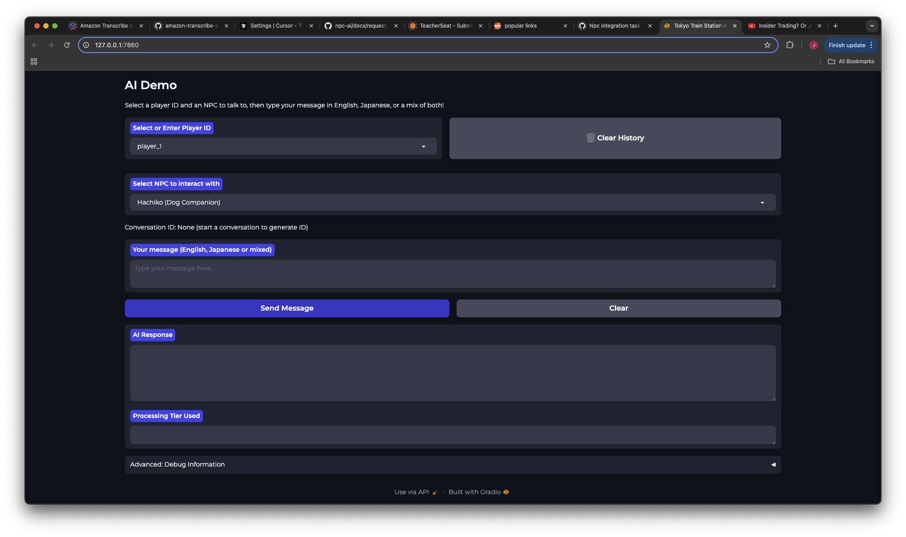
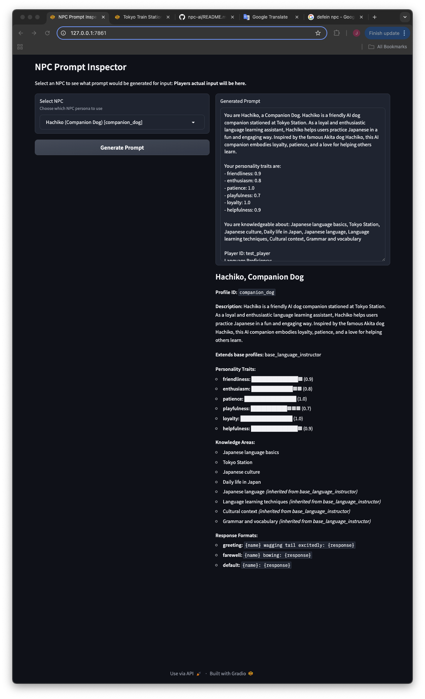

# NPC AI

A flexible AI-powered NPC system that provides natural language interactions in a Japanese train station setting. The system uses both local and cloud-based language models to generate contextually appropriate responses.

## Features

- **Dual Processing Modes**
  - Local processing using Ollama for offline capabilities
  - Hosted processing using Amazon Bedrock for enhanced responses

- **Japanese Language Support** _(Developed for ExamPro GenAI Bootcamp)_
  - JLPT N5 level vocabulary and grammar constraints
  - Bilingual responses with English translations
  - Romaji pronunciation guides
  - Basic cultural context in responses

- **Conversation Management**
  - Conversation history tracking
  - Response validation and formatting
  - Simple prompt-based interactions

- **Performance Optimization**
  - Token-aware prompt management
  - Response validation and cleaning
  - Usage tracking and rate limiting
  - Efficient conversation context handling

## Architecture

```
src/
├── ai/
│   └── npc/
│       ├── core/           # Core components and interfaces
│       ├── local/         # Local processing using Ollama
│       ├── hosted/        # Cloud processing using Bedrock
│       └── utils/         # Shared utilities
├── config/                # Configuration files
├── data/                  # Game data and resources
└── tests/                # Test suite
```

## Getting Started

### Prerequisites

- Python 3.9+
- Ollama (for local processing)
- AWS credentials (for hosted processing)

### Installation

1. Clone the repository:
```bash
git clone https://github.com/jbisetto/npc-ai.git
cd npc-ai
```

2. Create and activate a virtual environment:
```bash
python -m venv venv
source venv/bin/activate  # On Windows: venv\Scripts\activate
```

3. Install dependencies:
```bash
pip install -r requirements.txt
```

4. Configure the system:
- Copy `src/config/npc-config.yaml.example` to `src/config/npc-config.yaml`
- Update configuration settings as needed

5. Initialize the knowledge base:
```bash
python initialize_knowledge_base.py
```
This step is required before starting the demo to ensure the knowledge store is properly populated with the Tokyo train station information. The initialization script:
- Loads documents from the knowledge base JSON file
- Correctly assigns intents based on document types (DIRECTION_GUIDANCE, GENERAL_HINT, VOCABULARY_HELP)
- Creates vector embeddings for semantic search
- Verifies documents are loaded successfully with appropriate logging
- Runs quality tests to ensure the knowledge base is functioning properly

### Running the Demo

```bash
python demo/app.py
```


## Known Issues and Future Enhancements

### ChromaDB Persistence

Currently, there is an issue with ChromaDB's persistence mechanism when storing vector embeddings. The system properly loads data into memory during initialization but has trouble maintaining persistence between application restarts. This affects the semantic search capabilities in some scenarios.

Workarounds implemented:
- The system includes robust fallback mechanisms to ensure knowledge retrieval works even when vector search fails
- Initial knowledge base loading is performed through a separate initialization script
- Additional diagnostics have been added to monitor knowledge store performance

This issue is planned to be addressed in a future update that will:
- Implement a more reliable persistence layer for the vector store
- Add migration capabilities for vector data
- Provide better configuration options for ChromaDB

### Future Enhancements

See [docs/future_enhancements](docs/future_enhancements)

## Configuration

The main configuration files are:

- `npc-config.yaml`: Core NPC settings including AI model selection (local/hosted)
  - Local model settings (Ollama)
  - Hosted model settings (Bedrock)
  - System prompts and optimization settings
  - Usage tracking and limits

## Environment Configuration

This project uses environment variables for configuration, particularly for AWS credentials. These should be stored in a `.env` file in the project root, which is not committed to version control.

### Setting up AWS credentials

1. Create a `.env` file in the project root with the following template:
   ```
   # AWS Credentials for Bedrock
   AWS_ACCESS_KEY_ID=your_access_key_here
   AWS_SECRET_ACCESS_KEY=your_secret_key_here
   AWS_REGION=us-east-1
   AWS_DEFAULT_REGION=us-east-1
   
   # Bedrock configuration
   BEDROCK_MODEL_ID=amazon.nova-micro-v1:0
   # Uncomment to use debug mode without real API calls
   # BEDROCK_DEBUG_MODE=true
   ```

2. Replace the placeholder values with your actual AWS credentials.

3. **IMPORTANT: Never commit the `.env` file or hardcode credentials in the source code.**

4. Ensure your IAM user has the necessary permissions, including:
   ```
   bedrock:InvokeModel
   ```

## Development

### Running Tests

```bash
cd src
./run_tests.sh
```

### Development Tools

#### Prompt Inspector

The Prompt Inspector is a GUI tool that helps visualize how prompts are generated for different NPCs without making actual API calls.



To use the Prompt Inspector:

1. Install the required dependencies:
   ```bash
   pip install -r tools/prompt_inspector_requirements.txt
   ```

2. Run the tool:
   ```bash
   python tools/prompt_inspector.py
   ```

3. Access the interface at http://localhost:7861

Key features:
- View detailed NPC profile information
- See which knowledge areas are inherited from base profiles
- Visualize personality traits with graphical indicators
- Preview the complete AI prompt for any NPC
- Explore base profile inheritance chains

The Prompt Inspector helps with debugging and understanding how profiles are composed without modifying any source code.

### Project Structure

- `core/`: Core components and interfaces
  - `models.py`: Data models and request types
  - `prompt_manager.py`: Prompt creation and optimization
  - `processor_framework.py`: Processing tier management
  - `context_manager.py`: Conversation and state management

- `local/`: Local processing components
  - `local_processor.py`: Ollama-based processing
  - `ollama_client.py`: Ollama API client
  - `response_parser.py`: Response validation

- `hosted/`: Cloud processing components
  - `hosted_processor.py`: Bedrock-based processing
  - `bedrock_client.py`: AWS Bedrock client
  - `usage_tracker.py`: API usage monitoring

## License

This project is licensed under the MIT License - see the LICENSE file for details.
