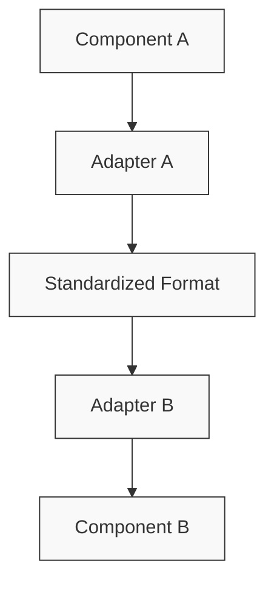

# Adapter Implementation Guide

This document provides guidelines for implementing adapters within the NPC AI system to standardize data formats between components.

## Adapter Pattern Overview

The NPC AI system uses the adapter pattern to standardize data formats between components. This allows different components to work together seamlessly despite differences in their internal data representations.



## Standard Formats

### History Entry Format

The standardized history entry format is:

```python
class HistoryEntry(BaseModel):
    role: str  # "user" or "assistant"
    content: str  # The message content
    timestamp: Optional[datetime] = None  # When the message was sent
    metadata: Dict[str, Any] = Field(default_factory=dict)  # Additional metadata
```

### Knowledge Document Format

The standardized knowledge document format is:

```python
class KnowledgeDocument(BaseModel):
    text: str  # The document text
    source: Optional[str] = None  # Source of the document
    metadata: Dict[str, Any] = Field(default_factory=dict)  # Additional metadata
    embedding: Optional[List[float]] = None  # Vector embedding if available
```

### NPC Profile Format

The standardized NPC profile format is:

```python
class NPCProfile(BaseModel):
    name: str  # NPC name
    role: str  # NPC role
    personality: List[str] = Field(default_factory=list)  # Personality traits
    knowledge_areas: List[str] = Field(default_factory=list)  # Areas of expertise
    speech_style: Optional[str] = None  # Speech style description
    languages: List[str] = Field(default_factory=lambda: ["English"])  # Languages spoken
    location: Optional[str] = None  # Current location
    backstory: Optional[str] = None  # Character backstory
    appearance: Optional[str] = None  # Physical appearance
    metadata: Dict[str, Any] = Field(default_factory=dict)  # Additional metadata
```

## Existing Adapters

### History Adapter

The history adapter converts between different conversation history formats:

```python
class DefaultConversationHistoryAdapter:
    """Default adapter for conversation history."""
    
    def to_standard_format(self, history: List[Dict[str, Any]]) -> List[HistoryEntry]:
        """Convert history to standardized format."""
        standardized = []
        
        for entry in history:
            if "user_input" in entry and "response" in entry:
                # Convert from legacy format
                standardized.append(HistoryEntry(
                    role="user",
                    content=entry["user_input"],
                    timestamp=entry.get("timestamp"),
                    metadata=entry.get("metadata", {})
                ))
                standardized.append(HistoryEntry(
                    role="assistant",
                    content=entry["response"],
                    timestamp=entry.get("timestamp"),
                    metadata=entry.get("metadata", {})
                ))
            elif "role" in entry and "content" in entry:
                # Already in standard format
                standardized.append(HistoryEntry(**entry))
        
        return standardized
```

### Knowledge Adapter

The knowledge adapter converts between different knowledge document formats:

```python
class DefaultKnowledgeContextAdapter:
    """Default adapter for knowledge context."""
    
    def to_standard_format(self, documents: List[Dict[str, Any]]) -> List[KnowledgeDocument]:
        """Convert knowledge documents to standardized format."""
        standardized = []
        
        for doc in documents:
            if isinstance(doc, KnowledgeDocument):
                # Already in standard format
                standardized.append(doc)
            elif "text" in doc:
                # Convert from legacy format
                metadata = {}
                if "metadata" in doc:
                    metadata = doc["metadata"]
                elif "score" in doc:
                    metadata["relevance_score"] = doc["score"]
                
                standardized.append(KnowledgeDocument(
                    text=doc["text"],
                    source=doc.get("source"),
                    metadata=metadata
                ))
        
        return standardized
```

## Implementing a New Adapter

To implement a new adapter, follow these steps:

1. **Define your adapter class**:

```python
class MyNewAdapter:
    """Adapter for converting between formats."""
    
    def to_standard_format(self, input_data: Any) -> StandardFormat:
        """Convert from custom format to standard format."""
        # Implementation here
        
    def from_standard_format(self, standard_data: StandardFormat) -> Any:
        """Convert from standard format to custom format."""
        # Implementation here
```

2. **Handle edge cases**:

```python
def to_standard_format(self, input_data: Any) -> StandardFormat:
    """Convert from custom format to standard format."""
    if input_data is None:
        return []
    
    if isinstance(input_data, StandardFormat):
        return input_data
    
    # Normal conversion logic
    # ...
```

3. **Validate the output**:

```python
def to_standard_format(self, input_data: Any) -> StandardFormat:
    """Convert from custom format to standard format."""
    result = []
    
    # Conversion logic
    # ...
    
    # Validate the output
    for item in result:
        if not isinstance(item, StandardFormatItem):
            raise ValueError(f"Invalid item in result: {item}")
    
    return result
```

## Best Practices

### 1. Always specify parameter types

Make the standardized format parameter explicit:

```python
# Good
async def contextual_search(
    self, 
    request: ClassifiedRequest,
    standardized_format: bool = False
) -> Union[List[Dict[str, Any]], List[KnowledgeDocument]]:
    # ...

# Avoid
async def contextual_search(self, request, standardized=False):
    # ...
```

### 2. Document format transformations

Document the format transformations in your adapter:

```python
def to_standard_format(self, history: List[Dict[str, Any]]) -> List[HistoryEntry]:
    """
    Convert history to standardized format.
    
    Input format:
    [
        {"user_input": "Hello", "response": "Hi", "timestamp": "2023-01-01T12:00:00Z"},
        ...
    ]
    
    Output format:
    [
        {"role": "user", "content": "Hello", "timestamp": "2023-01-01T12:00:00Z"},
        {"role": "assistant", "content": "Hi", "timestamp": "2023-01-01T12:00:00Z"},
        ...
    ]
    """
    # Implementation
```

### 3. Use adapter registry pattern

Create a registry for adapters to facilitate finding the right adapter:

```python
class AdapterRegistry:
    """Registry for adapters."""
    
    _adapters: Dict[str, Any] = {}
    
    @classmethod
    def register(cls, name: str, adapter: Any) -> None:
        """Register an adapter."""
        cls._adapters[name] = adapter
    
    @classmethod
    def get(cls, name: str) -> Any:
        """Get an adapter by name."""
        return cls._adapters.get(name)
```

### 4. Test adapter conversions thoroughly

Write comprehensive tests for adapters:

```python
def test_history_adapter_conversion():
    """Test conversion from legacy to standard format."""
    adapter = DefaultConversationHistoryAdapter()
    
    legacy_format = [
        {"user_input": "Hello", "response": "Hi", "timestamp": "2023-01-01T12:00:00Z"}
    ]
    
    result = adapter.to_standard_format(legacy_format)
    
    assert len(result) == 2
    assert result[0].role == "user"
    assert result[0].content == "Hello"
    assert result[1].role == "assistant"
    assert result[1].content == "Hi"
```

### 5. Handle backward compatibility

Ensure adapters can handle both new and old formats:

```python
def to_standard_format(self, documents: List[Dict[str, Any]]) -> List[KnowledgeDocument]:
    """Convert knowledge documents to standardized format."""
    standardized = []
    
    for doc in documents:
        if isinstance(doc, KnowledgeDocument):
            # Already in standard format
            standardized.append(doc)
        elif "text" in doc:
            # Legacy format version 2
            # ...
        elif "content" in doc:
            # Legacy format version 1
            # ...
        else:
            logging.warning(f"Unknown document format: {doc}")
    
    return standardized
```

## Implementation Steps

When implementing a new adapter, follow these steps:

1. **Analyze the source format** - Understand the source data format
2. **Define the target format** - Understand the standardized format
3. **Implement conversion logic** - Write the conversion logic
4. **Handle edge cases** - Consider null values, empty lists, etc.
5. **Write tests** - Test with various input formats
6. **Update call sites** - Update all code that uses the adapter
7. **Document the adapter** - Document the adapter's behavior

## Adapter Interface Guidelines

Adapters should follow consistent interfaces:

```python
class Adapter:
    """Base adapter interface."""
    
    def to_standard_format(self, input_data: Any) -> StandardFormat:
        """Convert from custom format to standard format."""
        raise NotImplementedError
    
    def from_standard_format(self, standard_data: StandardFormat) -> Any:
        """Convert from standard format to custom format."""
        raise NotImplementedError
```

## Example Adapter Implementation

Here's a complete example of a new adapter implementation:

```python
from typing import List, Dict, Any, Optional
from datetime import datetime

class HistoryEntry:
    """Standardized history entry."""
    
    def __init__(self, role: str, content: str, timestamp: Optional[datetime] = None, metadata: Optional[Dict[str, Any]] = None):
        self.role = role
        self.content = content
        self.timestamp = timestamp
        self.metadata = metadata or {}

class LegacyHistoryAdapter:
    """Adapter for legacy conversation history format."""
    
    def to_standard_format(self, legacy_history: List[Dict[str, Any]]) -> List[HistoryEntry]:
        """
        Convert legacy history to standardized format.
        
        Legacy format:
        [
            {"sender": "player", "message": "Hello", "time": "2023-01-01T12:00:00Z"},
            {"sender": "npc", "message": "Hi", "time": "2023-01-01T12:00:01Z"},
        ]
        """
        if not legacy_history:
            return []
        
        result = []
        
        for entry in legacy_history:
            role = "user" if entry.get("sender") == "player" else "assistant"
            content = entry.get("message", "")
            
            # Parse timestamp if present
            timestamp = None
            if "time" in entry:
                try:
                    timestamp = datetime.fromisoformat(entry["time"].replace("Z", "+00:00"))
                except (ValueError, TypeError):
                    pass
            
            # Create metadata
            metadata = {}
            for key, value in entry.items():
                if key not in ("sender", "message", "time"):
                    metadata[key] = value
            
            result.append(HistoryEntry(
                role=role,
                content=content,
                timestamp=timestamp,
                metadata=metadata
            ))
        
        return result
    
    def from_standard_format(self, standard_history: List[HistoryEntry]) -> List[Dict[str, Any]]:
        """Convert standardized history to legacy format."""
        if not standard_history:
            return []
        
        result = []
        
        for entry in standard_history:
            sender = "player" if entry.role == "user" else "npc"
            
            legacy_entry = {
                "sender": sender,
                "message": entry.content
            }
            
            # Add timestamp if present
            if entry.timestamp:
                legacy_entry["time"] = entry.timestamp.isoformat().replace("+00:00", "Z")
            
            # Add metadata
            for key, value in entry.metadata.items():
                legacy_entry[key] = value
            
            result.append(legacy_entry)
        
        return result
``` 