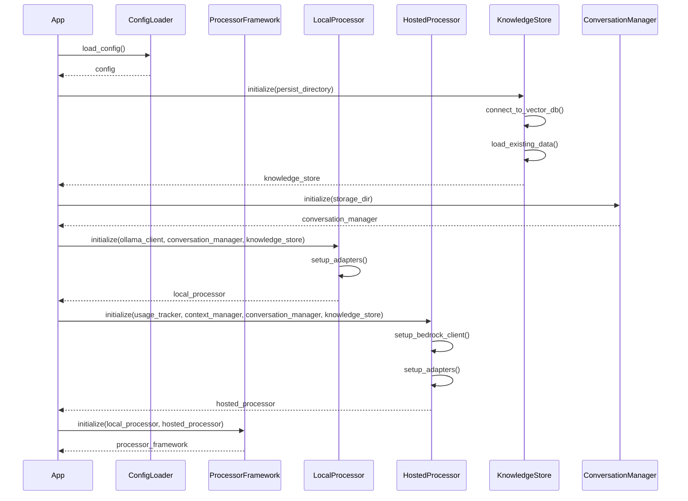
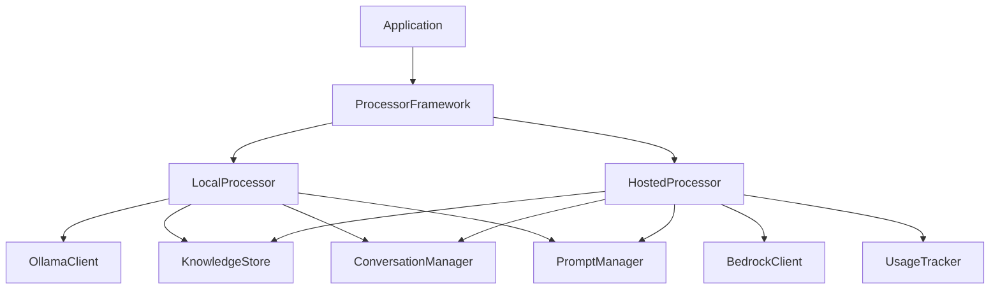

# NPC AI System Initialization Sequence

This document describes how the NPC AI system initializes its components, loads configurations, and establishes dependencies.

## Initialization Flow

The system follows a specific initialization sequence to ensure all components are properly configured before processing requests:



## Component Dependencies

The system uses dependency injection to manage component relationships:



## Configuration Loading

The configuration loading process follows this sequence:

1. Load environment variables (from `.env` file if present)
2. Load default configurations from YAML files
3. Apply environment variable overrides
4. Validate configuration values
5. Initialize components with appropriate config sections

## Lazy Initialization

The system uses lazy initialization for resource-intensive components:

```python
def get_knowledge_store():
    """Get or initialize the knowledge store."""
    global _knowledge_store
    if _knowledge_store is None:
        # Initialize the store when first needed
        _knowledge_store = TokyoKnowledgeStore(persist_directory=get_config('knowledge_store.path'))
    return _knowledge_store
```

## Singleton Management

Components that should only have one instance use singleton patterns:

```python
# Global variable to store the local processor instance
_local_processor: Optional['LocalProcessor'] = None

def get_local_processor() -> 'LocalProcessor':
    """Returns a LocalProcessor instance, creating it if necessary."""
    global _local_processor
    if _local_processor is None:
        _local_processor = LocalProcessor()
    return _local_processor
```

## Configuration Validation

The system validates configurations during initialization:

```python
def validate_config(config: Dict[str, Any]) -> None:
    """Validate the loaded configuration."""
    # Ensure required sections exist
    required_sections = ['local', 'hosted', 'knowledge_store']
    for section in required_sections:
        if section not in config:
            raise ConfigError(f"Missing required configuration section: {section}")
    
    # Validate local processor configuration
    if 'base_url' not in config['local']:
        raise ConfigError("Local processor config missing 'base_url'")
    
    # Validate hosted processor configuration
    if 'bedrock' not in config['hosted']:
        raise ConfigError("Hosted processor config missing 'bedrock' section")
```

## Error Handling During Initialization

The system handles initialization errors gracefully:

1. Configuration errors are detected early and provide clear messages
2. Network-dependent components (like BedrockClient) fall back to debug modes when connections fail
3. Missing resources are created when possible (e.g., directories for persistence)
4. Detailed logging during initialization helps diagnose issues

## Initialization Timeouts

Components with external dependencies implement initialization timeouts:

```python
# Example of timeout handling during initialization
async def initialize_with_timeout(timeout_seconds: int = 10):
    """Initialize with a timeout to prevent hanging."""
    try:
        # Create a task with timeout
        await asyncio.wait_for(async_initialize(), timeout=timeout_seconds)
    except asyncio.TimeoutError:
        logger.error(f"Initialization timed out after {timeout_seconds} seconds")
        # Fall back to debug mode or default configuration
        initialize_fallback()
``` 