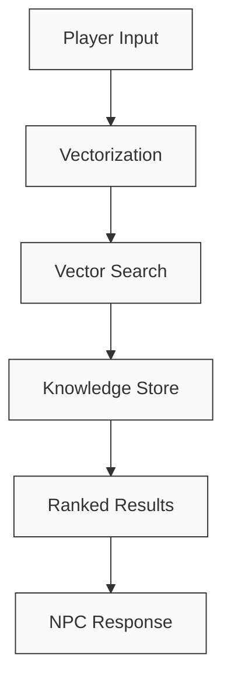
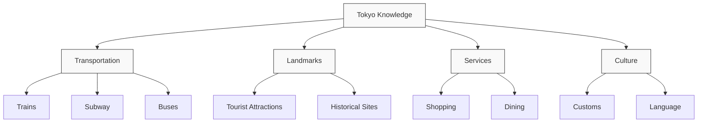
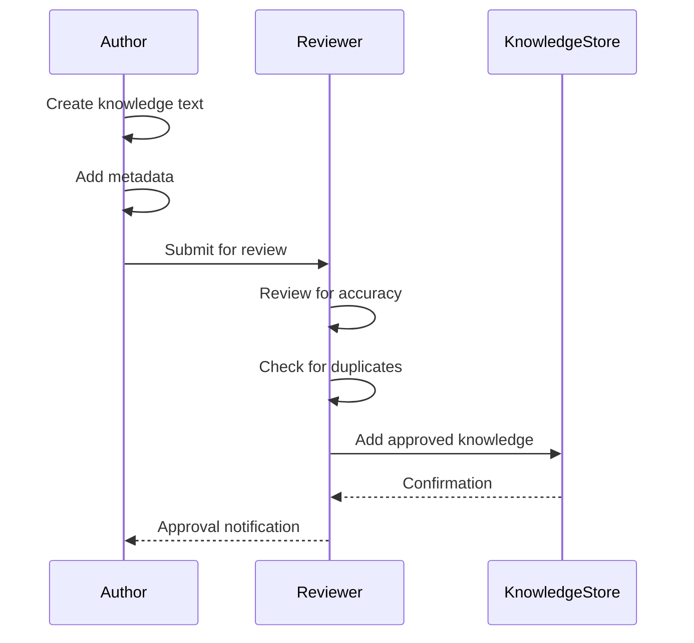

# Knowledge Management Guide

This document explains how to manage knowledge within the NPC AI system, including creation, maintenance, and optimization of the knowledge base.

## Knowledge Store Architecture

The NPC AI system uses a vector-based knowledge store to retrieve relevant information based on semantic similarity:



## Knowledge Document Format

Each piece of knowledge is stored in a standardized format:

```python
class KnowledgeDocument:
    """A document in the knowledge store."""
    
    def __init__(
        self,
        text: str,
        source: Optional[str] = None,
        metadata: Optional[Dict[str, Any]] = None,
        embedding: Optional[List[float]] = None
    ):
        self.text = text
        self.source = source
        self.metadata = metadata or {}
        self.embedding = embedding
```

## Knowledge Store Implementation

The system uses ChromaDB as the underlying vector database:

```python
class TokyoKnowledgeStore(KnowledgeStore):
    """Knowledge store implementation using ChromaDB."""
    
    def __init__(
        self,
        persist_directory: str = "data/vector_store",
        collection_name: str = "tokyo_knowledge",
        embedding_model: str = "all-MiniLM-L6-v2",
        cache_size: int = 1000,
        client=None
    ):
        # Initialize with persistence directory and collection name
        # ...
```

## Adding Knowledge

Knowledge can be added to the store in several ways:

### 1. Adding Individual Documents

```python
# Add a single document
await knowledge_store.add_knowledge(
    text="The Yamanote Line is a loop line that connects major stations in Tokyo.",
    metadata={
        "type": "transportation",
        "tags": ["train", "tokyo", "yamanote"]
    }
)
```

### 2. Bulk Loading from Files

```python
# Load knowledge from a JSON file
knowledge_store.load_knowledge_base("data/knowledge/tokyo_facts.json")

# Load knowledge from a CSV file
knowledge_store.load_from_csv("data/knowledge/stations.csv")
```

### 3. Knowledge File Format

JSON knowledge file format:

```json
[
    {
        "text": "The Yamanote Line is a loop line that connects major stations in Tokyo.",
        "source": "tokyo_transportation.md",
        "metadata": {
            "type": "transportation",
            "tags": ["train", "tokyo", "yamanote"]
        }
    },
    {
        "text": "Tokyo Station is the main intercity rail terminal in Tokyo.",
        "source": "tokyo_stations.md",
        "metadata": {
            "type": "location",
            "tags": ["station", "tokyo"]
        }
    }
]
```

## Searching for Knowledge

The knowledge store provides contextual search capabilities:

```python
# Search for knowledge related to a request
results = await knowledge_store.contextual_search(
    request,
    standardized_format=True,
    max_results=5
)

# Access the results
for doc in results:
    print(f"Text: {doc.text}")
    print(f"Source: {doc.source}")
    print(f"Relevance: {doc.metadata.get('relevance_score')}")
```

## Knowledge Categorization

Knowledge can be categorized using metadata:

```python
# Adding categorized knowledge
await knowledge_store.add_knowledge(
    text="Tokyo Tower is a communications and observation tower located in Minato, Tokyo.",
    metadata={
        "type": "landmark",
        "location": "Minato",
        "coordinates": {"lat": 35.6586, "lng": 139.7454},
        "category": "attraction",
        "tags": ["tower", "tourist", "observation"]
    }
)
```

## Knowledge Types

The system supports different types of knowledge:

1. **Factual Knowledge** - Objective facts about the world
2. **Contextual Knowledge** - Information relevant to specific contexts
3. **Procedural Knowledge** - How to perform specific tasks
4. **Relational Knowledge** - Relationships between entities

Example of different knowledge types:

```python
# Factual knowledge
await knowledge_store.add_knowledge(
    text="Tokyo is the capital city of Japan with a population of approximately 14 million.",
    metadata={"type": "factual", "category": "geography"}
)

# Procedural knowledge
await knowledge_store.add_knowledge(
    text="To get from Tokyo Station to Shinjuku, take the JR Yamanote Line bound for Shibuya and get off at Shinjuku Station.",
    metadata={"type": "procedural", "category": "transportation"}
)

# Relational knowledge
await knowledge_store.add_knowledge(
    text="Shinjuku Station is connected to Shibuya Station via the Yamanote Line and to Tokyo Station via both the Yamanote and Chuo Lines.",
    metadata={"type": "relational", "category": "transportation"}
)
```

## Knowledge Organization

Organize knowledge into logical categories to improve search relevance:



## Vector Search Tuning

Optimize vector search for better results:

### 1. Embedding Model Selection

The choice of embedding model affects search quality:

```python
# Initialize with a specific embedding model
store = TokyoKnowledgeStore(
    embedding_model="all-MiniLM-L6-v2"  # Good balance of quality and performance
)
```

Common embedding models:
- `all-MiniLM-L6-v2` - Small, fast model with good performance
- `all-mpnet-base-v2` - Higher quality but slower
- `paraphrase-multilingual-mpnet-base-v2` - Good for multilingual applications

### 2. Similarity Threshold

Adjust the similarity threshold to control result quality:

```python
# Set a higher threshold for more selective results
results = await knowledge_store.contextual_search(
    request,
    similarity_threshold=0.75  # Only return highly relevant results
)
```

### 3. Result Filtering

Filter results based on metadata:

```python
# Filter results by metadata
results = await knowledge_store.contextual_search(
    request,
    filter={"type": "transportation"}  # Only return transportation knowledge
)
```

## Knowledge Ingestion Workflow

Follow this workflow for ingesting new knowledge:



## Knowledge Update Process

Update existing knowledge using this process:

```python
# Identify knowledge to update
results = await knowledge_store.search("Tokyo Olympic Stadium")

# Update the document
document_id = results[0].metadata.get("id")
await knowledge_store.update_knowledge(
    document_id,
    text="The Japan National Stadium was the main venue for the 2020 Summer Olympics, completed in 2019.",
    metadata={"last_updated": "2023-06-15"}
)
```

## Knowledge Retrieval Troubleshooting

### Issue: Irrelevant results in search

**Possible causes:**
1. Poor query formulation
2. Insufficient knowledge in the store
3. Inappropriate similarity threshold
4. Embedding model mismatch

**Solutions:**
1. Improve query extraction from user input
2. Add more relevant knowledge
3. Adjust similarity threshold
4. Try a different embedding model

### Issue: No results for valid queries

**Possible causes:**
1. Knowledge gap in the system
2. Similarity threshold too high
3. Embedding model not capturing the relationship

**Solutions:**
1. Add missing knowledge
2. Lower the similarity threshold
3. Try a different embedding model

## Maintaining Knowledge Quality

### 1. Regular Reviews

Schedule regular reviews of the knowledge base:

```python
# Get knowledge stats
stats = knowledge_store.get_stats()
print(f"Total documents: {stats['document_count']}")
print(f"Last update: {stats['last_updated']}")
```

### 2. Duplicate Detection

Check for and remove duplicate knowledge:

```python
# Find potential duplicates
duplicates = await knowledge_store.find_duplicates(similarity_threshold=0.9)

# Review and remove duplicates
for doc_id_1, doc_id_2, similarity in duplicates:
    print(f"Potential duplicate: {doc_id_1} and {doc_id_2} ({similarity:.2f})")
    # Review and decide which to keep
```

### 3. Knowledge Freshness

Track the age of knowledge and update as needed:

```python
# Find old knowledge
old_docs = await knowledge_store.search(
    filter={"last_updated": {"$lt": "2022-01-01"}}
)

# Review and update
for doc in old_docs:
    print(f"Old document: {doc.text}")
    # Update if necessary
```

## Knowledge Base Analytics

Monitor knowledge base usage:

```python
# Get retrieval statistics
analytics = knowledge_store.get_analytics()

# Most frequently retrieved knowledge
for doc_id, count in analytics["retrieval_count"].items():
    if count > 10:
        doc = await knowledge_store.get_document(doc_id)
        print(f"Frequently retrieved: {doc.text} ({count} times)")

# Knowledge gaps (queries with no good results)
for query, count in analytics["failed_queries"].items():
    if count > 5:
        print(f"Knowledge gap: {query} ({count} times)")
```

## Best Practices

1. **Keep knowledge concise** - Short, focused pieces of knowledge work better than long paragraphs
2. **Add rich metadata** - More metadata improves search and filtering
3. **Organize logically** - Group related knowledge together
4. **Regular updates** - Keep knowledge current and accurate
5. **Test queries** - Regularly test common queries to ensure good results
6. **Monitor performance** - Track search quality and speed
7. **Balance coverage and precision** - Cover important topics without overwhelming the system 