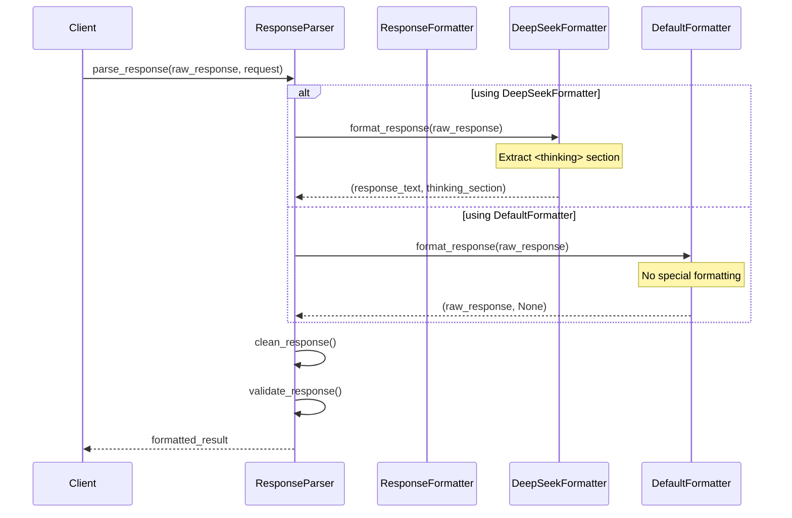
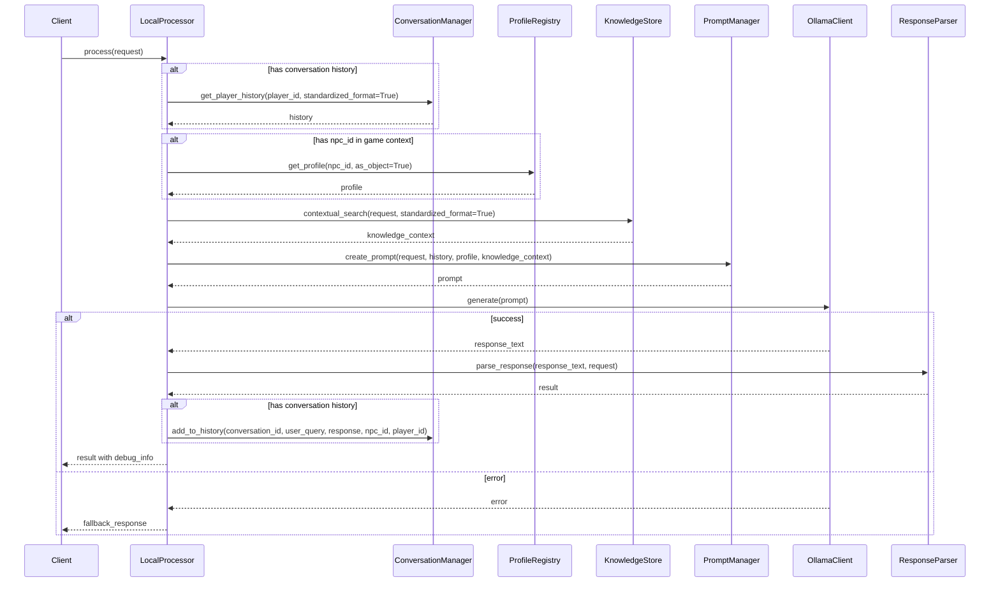
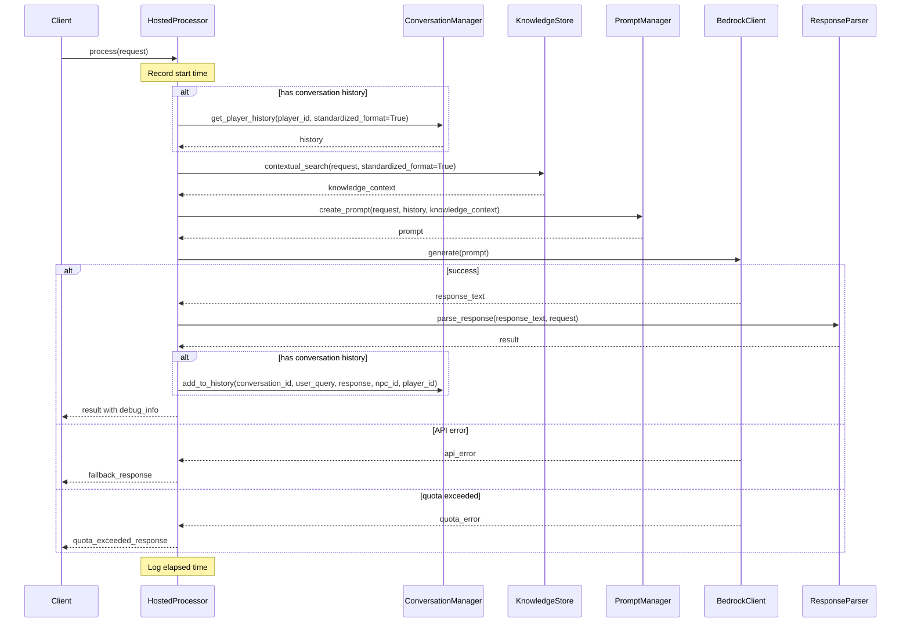
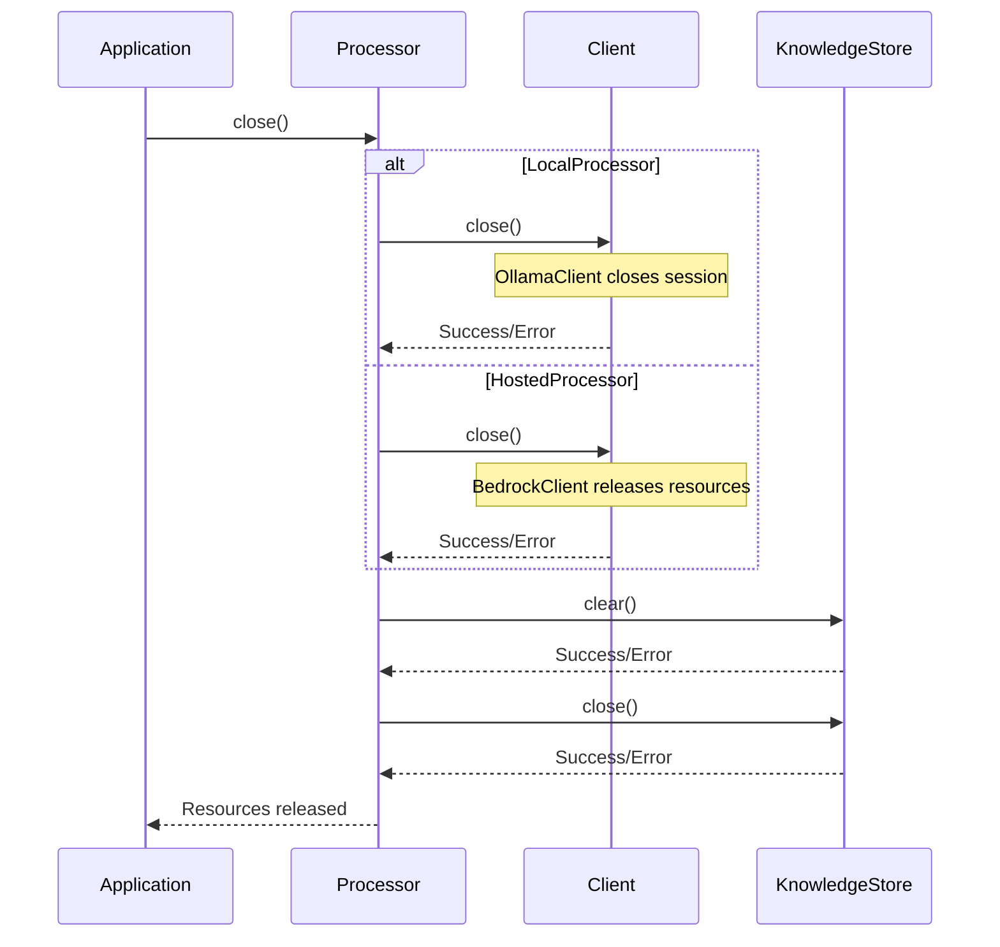
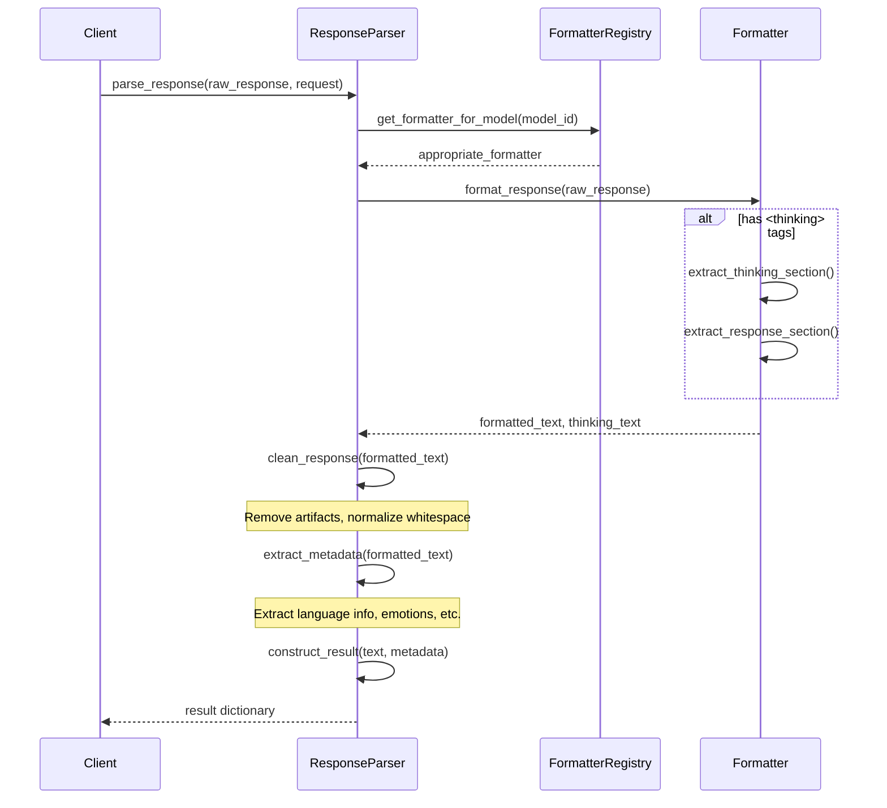
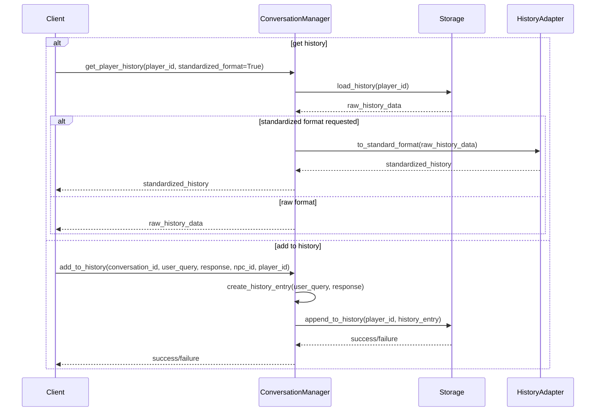
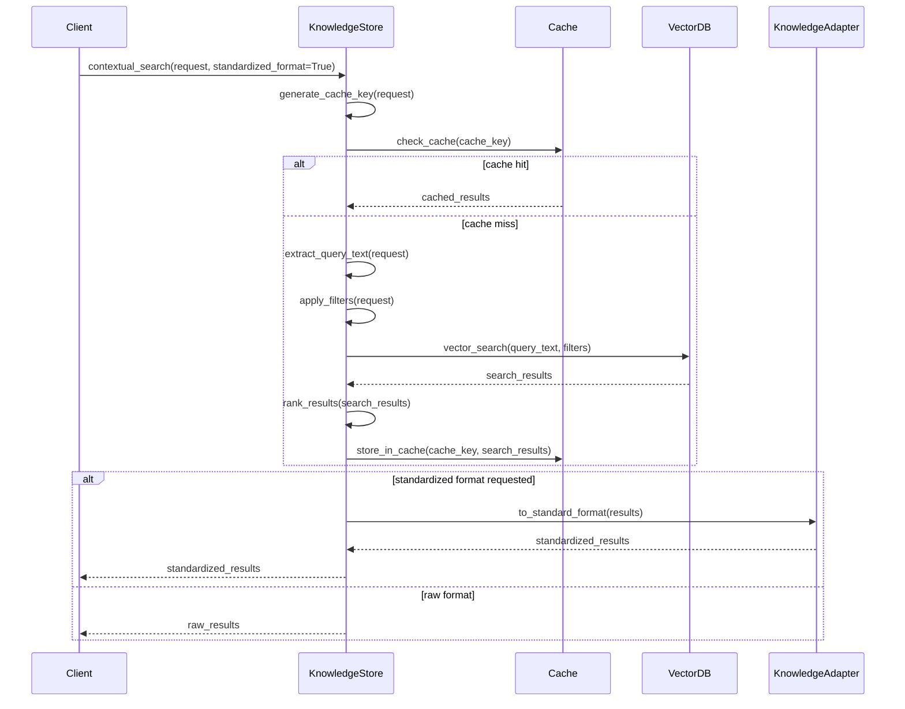
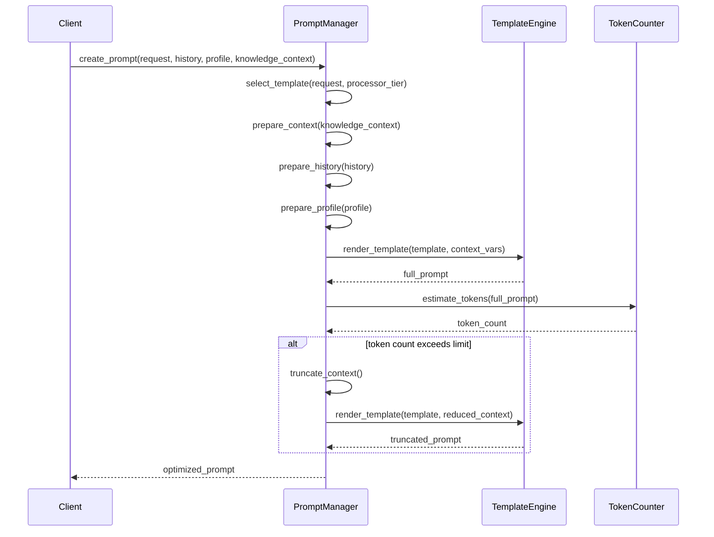
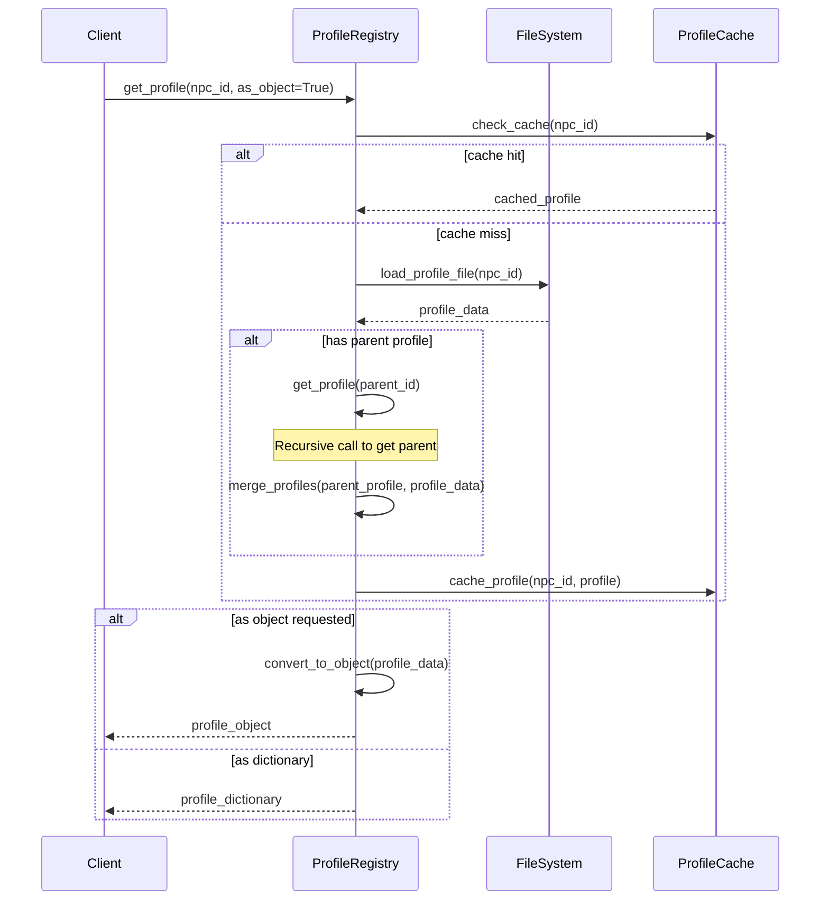

# NPC AI Request Processing Flow

This document describes how the NPC AI system processes requests using both local and hosted processors. It includes sequence diagrams and explanations of the key components and their interactions.

## Processor Selection

The system uses a simple processor selection based on the `processing_tier` field in the request:

1. **Selection Logic**
   ```mermaid
   sequenceDiagram
       Player->>ProcessorFramework: NPCRequest
       Note over ProcessorFramework: Check processing_tier
       
       alt processing_tier == LOCAL
           ProcessorFramework->>LocalProcessor: Process Request
           LocalProcessor-->>Player: Response
       else processing_tier == HOSTED
           ProcessorFramework->>HostedProcessor: Process Request
           HostedProcessor-->>Player: Response
       end
   ```

2. **Request Model**
   ```python
   class NPCRequest(BaseModel):
       request_id: str
       player_input: str
       game_context: Optional[GameContext] = None
       processing_tier: Optional[ProcessingTier] = None
       additional_params: Dict[str, Any] = field(default_factory=lambda: {
           METADATA_KEY_INTENT: INTENT_DEFAULT
       })
   ```

3. **Processing Tier Enum**
   ```python
   class ProcessingTier(Enum):
       LOCAL = "local"
       HOSTED = "hosted"
   ```

## Response Formatting Flow
The system uses a formatter-based approach to handle different LLM response formats:



## Local Processor Flow
The local processor uses Ollama for generating responses locally.



## Hosted Processor Flow
The hosted processor uses Amazon Bedrock for cloud-based response generation.



## Resource Cleanup Flow

Both processors implement a `close` method to properly release resources when they're no longer needed:



## Response Formatter Design

The system uses the Strategy pattern to handle different LLM response formats:

1. **ResponseFormatter Protocol**
   ```python
   class ResponseFormatter(Protocol):
       def format_response(self, raw_response: str) -> tuple[str, Optional[str]]:
           """Format a raw response from an LLM."""
           ...
   ```

2. **Concrete Formatters**
   ```python
   class DeepSeekFormatter:
       """Formats responses from DeepSeek models which use <thinking> tags."""
       def format_response(self, raw_response: str) -> tuple[str, Optional[str]]:
           # Extract <thinking> sections
           ...

   class DefaultFormatter:
       """Default formatter for LLMs that don't have special formatting needs."""
       def format_response(self, raw_response: str) -> tuple[str, Optional[str]]:
           return raw_response.strip(), None
   ```

3. **Usage**
   ```python
   # Parse response with the appropriate formatter
   result = self.response_parser.parse_response(response_text, request)
   ```

## Key Differences

1. **Model Backend**
   - Local: Uses Ollama for local model inference
   - Hosted: Uses Amazon Bedrock for cloud-based inference

2. **NPC Profile Handling**
   - Local: Loads and uses NPC profiles directly
   - Hosted: Currently doesn't explicitly use NPC profiles

3. **Response Formatting**
   - DeepSeek: Extracts thinking sections from `<thinking>` tags
   - Default: No special formatting, returns raw response

4. **Error Handling**
   - Local: Implements retry mechanism with error handling
   - Hosted: Handles quota errors specifically and tracks API usage

5. **Configuration**
   - Local: Simpler configuration focused on Ollama settings
   - Hosted: More complex configuration including API quotas, model settings

6. **Performance Monitoring**
   - Local: Basic error logging
   - Hosted: Comprehensive usage tracking and monitoring

7. **Resource Management**
   - Both processors implement a `close` method to release resources
   - Resources include clients, knowledge stores, and usage trackers

## Common Components

Both processors share these components:
- Conversation Manager: Tracks chat history
- Knowledge Store: Provides relevant context
- Prompt Manager: Creates optimized prompts
- Response Parser: Standardizes output format using appropriate formatter

## Component Details

### Response Parser and Formatters
- Uses Strategy pattern to handle different LLM response formats
- Supports multiple formatters for different LLMs
- Maintains clean separation of formatting logic
- Easy to add support for new LLM formats



### Conversation Manager
- Manages conversation history for each player
- Provides context for more coherent responses
- Handles conversation persistence
- Supports standardized format for interchangeable use between processors



### Knowledge Store
- Stores and retrieves relevant game information
- Provides context-aware responses using vector search
- Implements caching for performance
- Supports standardized format for consistent knowledge representation



### Prompt Manager
- Creates optimized prompts for each model
- Handles token limits and optimization
- Manages model-specific configurations
- Supports including NPC profiles, knowledge context, and conversation history



### NPC Profile Registry
- Loads and manages NPC profiles
- Provides profile data for personalized responses
- Supports profile inheritance and extension



## Error Handling

### Local Processor
- Implements error handling for OllamaClient errors
- Provides detailed error logging
- Generates fallback responses when errors occur

### Hosted Processor
- Handles quota errors specifically
- Tracks API usage and limits
- Provides tiered fallback responses
- Different messages for quota exceeded vs general errors

## Performance Considerations

### Local Processor
- Limited by local compute resources
- No API costs
- May have slower response times
- Lower infrastructure requirements

### Hosted Processor
- Higher quality responses
- Faster processing
- API usage costs
- Quota management required
- Higher infrastructure requirements

## Resource Management

Both processors implement a cleanup mechanism:

### LocalProcessor
- Closes OllamaClient to release network resources
- Clears and closes KnowledgeStore to release memory and database connections

### HostedProcessor
- Releases BedrockClient resources
- Closes UsageTracker if available
- Clears and closes KnowledgeStore to release memory and database connections