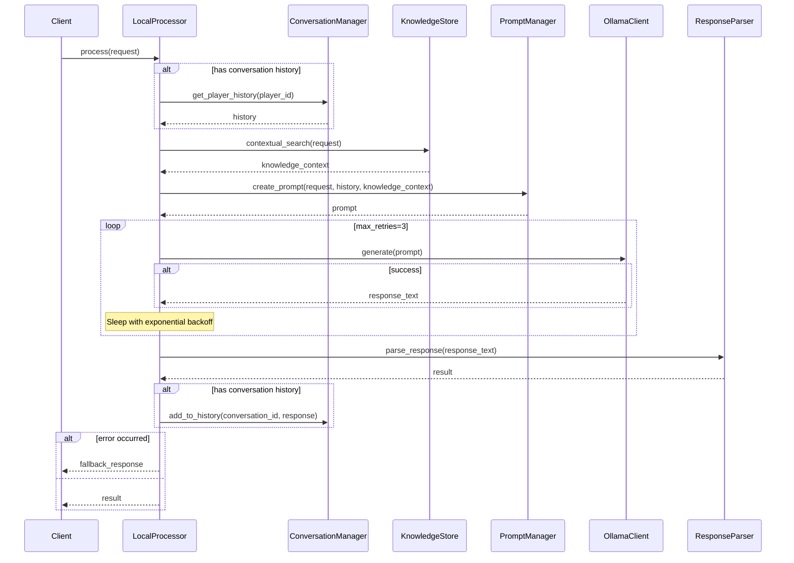
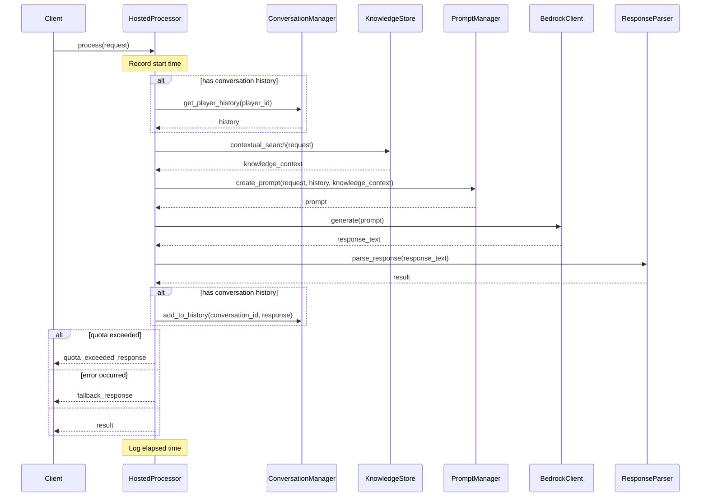

# NPC AI Request Processing Flow

This document describes how the NPC AI system processes requests using both local and hosted processors. It includes sequence diagrams and explanations of the key components and their interactions.

## Processor Selection

The system uses a simple processor selection based on the `processing_tier` field in the request:

1. **Selection Logic**
   ```mermaid
   sequenceDiagram
       Player->>ProcessorFramework: ClassifiedRequest
       Note over ProcessorFramework: Check processing_tier
       
       alt processing_tier == LOCAL
           ProcessorFramework->>LocalProcessor: Process Request
           LocalProcessor-->>Player: Response
       else processing_tier == HOSTED
           ProcessorFramework->>HostedProcessor: Process Request
           HostedProcessor-->>Player: Response
       end
   ```

2. **Request Model**
   ```python
   class ClassifiedRequest:
       processing_tier: ProcessingTier  # LOCAL or HOSTED
       additional_params: Dict[str, Any]  # Includes intent and other metadata
   ```

3. **Processing Tier Enum**
   ```python
   class ProcessingTier(Enum):
       LOCAL = "local"
       HOSTED = "hosted"
   ```

## Local Processor Flow
The local processor uses Ollama for generating responses locally.



## Hosted Processor Flow
The hosted processor uses Amazon Bedrock for cloud-based response generation.



## Key Differences

1. **Model Backend**
   - Local: Uses Ollama for local model inference
   - Hosted: Uses Amazon Bedrock for cloud-based inference

2. **Error Handling**
   - Local: Implements retry mechanism with exponential backoff
   - Hosted: Handles quota errors specifically and tracks API usage

3. **Configuration**
   - Local: Simpler configuration focused on Ollama settings
   - Hosted: More complex configuration including API quotas, model settings

4. **Performance Monitoring**
   - Local: Basic error logging
   - Hosted: Comprehensive usage tracking and monitoring

5. **Cost Considerations**
   - Local: Free to use, limited by local compute resources
   - Hosted: Pay-per-use, higher quality but more expensive

## Common Components

Both processors share these components:
- Conversation Manager: Tracks chat history
- Knowledge Store: Provides relevant context
- Prompt Manager: Creates optimized prompts
- Response Parser: Standardizes output format

## Component Details

### Conversation Manager
- Manages conversation history for each player
- Provides context for more coherent responses
- Handles conversation persistence

### Knowledge Store
- Stores and retrieves relevant game information
- Provides context-aware responses
- Implements caching for performance

### Prompt Manager
- Creates optimized prompts for each model
- Handles token limits and optimization
- Manages model-specific configurations

### Response Parser
- Standardizes response format
- Handles error cases
- Ensures consistent output structure

## Error Handling

### Local Processor
- Implements retry mechanism with exponential backoff
- Maximum of 3 retry attempts
- Provides generic fallback responses

### Hosted Processor
- Handles quota errors specifically
- Tracks API usage and limits
- Provides tiered fallback responses

## Performance Considerations

### Local Processor
- Limited by local compute resources
- No API costs
- May have slower response times

### Hosted Processor
- Higher quality responses
- Faster processing
- API usage costs
- Quota management required