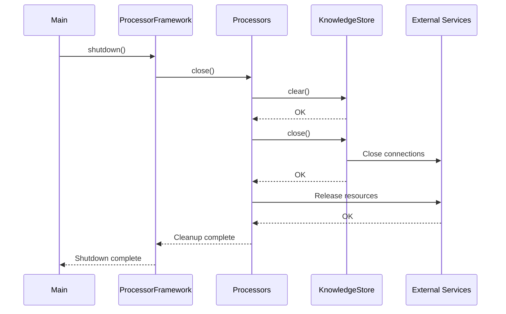

# Shutdown and Cleanup Procedures

This document outlines the proper procedures for shutting down the NPC AI system and cleaning up resources to prevent leaks and ensure integrity.

## Resource Cleanup Flow

The system implements resource cleanup through `close` methods on major components:



## Processor Cleanup

Both LocalProcessor and HostedProcessor implement cleanup methods:

### LocalProcessor

```python
async def close(self):
    """
    Close the processor and release any resources.
    
    This method should be called when the processor is no longer needed
    to ensure proper cleanup of resources.
    """
    logger.info("Closing local processor and releasing resources")
    
    # Close the Ollama client if it exists and has a close method
    if hasattr(self, 'ollama_client') and self.ollama_client is not None:
        try:
            await self.ollama_client.close()
            logger.debug("Successfully closed Ollama client")
        except Exception as e:
            logger.error(f"Error closing Ollama client: {e}", exc_info=True)
    
    # Close the knowledge store if it exists and has a close method
    if hasattr(self, 'knowledge_store') and self.knowledge_store is not None:
        try:
            if hasattr(self.knowledge_store, 'clear'):
                await self.knowledge_store.clear()
                logger.debug("Successfully cleared knowledge store")
            
            # If there's a more specific close method, call that too
            if hasattr(self.knowledge_store, 'close'):
                await self.knowledge_store.close()
                logger.debug("Successfully closed knowledge store")
        except Exception as e:
            logger.error(f"Error closing knowledge store: {e}", exc_info=True)
```

### HostedProcessor

```python
async def close(self):
    """
    Close the processor and release any resources.
    
    This method should be called when the processor is no longer needed
    to ensure proper cleanup of resources.
    """
    logger.info("Closing hosted processor and releasing resources")
    
    # Close the Bedrock client if it exists and has a close method
    if hasattr(self, 'client') and self.client is not None:
        try:
            if hasattr(self.client, 'close'):
                await self.client.close()
                logger.debug("Successfully closed Bedrock client")
        except Exception as e:
            logger.error(f"Error closing Bedrock client: {e}", exc_info=True)
    
    # Close the knowledge store if it exists and has a close method
    if hasattr(self, 'knowledge_store') and self.knowledge_store is not None:
        try:
            if hasattr(self.knowledge_store, 'clear'):
                await self.knowledge_store.clear()
                logger.debug("Successfully cleared knowledge store")
            
            # If there's a more specific close method, call that too
            if hasattr(self.knowledge_store, 'close'):
                await self.knowledge_store.close()
                logger.debug("Successfully closed knowledge store")
        except Exception as e:
            logger.error(f"Error closing knowledge store: {e}", exc_info=True)
```

## Client Cleanup

### OllamaClient

```python
async def close(self):
    """Close the client session."""
    await self._reset_session()
```

### BedrockClient

```python
async def close(self):
    """
    Close the client and release any resources.
    
    This method should be called when the client is no longer needed
    to ensure proper cleanup of resources.
    """
    logger.info("Closing Bedrock client")
    
    # Close boto3 client if it exists
    if hasattr(self, 'client') and self.client is not None:
        try:
            # boto3 clients don't have an explicit close method, but we can
            # set it to None to help with garbage collection
            self.client = None
            logger.debug("Successfully released Bedrock client resources")
        except Exception as e:
            logger.error(f"Error releasing Bedrock client resources: {e}", exc_info=True)
    
    # Close usage tracker if it exists and has a close method
    if hasattr(self, 'usage_tracker') and self.usage_tracker is not None:
        try:
            if hasattr(self.usage_tracker, 'close'):
                await self.usage_tracker.close()
                logger.debug("Successfully closed usage tracker")
        except Exception as e:
            logger.error(f"Error closing usage tracker: {e}", exc_info=True)
```

## Knowledge Store Cleanup

```python
async def clear(self) -> None:
    """
    Clear the knowledge store.
    """
    try:
        self.collection.delete(where={"test": True})
        self._cache = {}
        self.logger.info("Cleared knowledge store")
    except Exception as e:
        self.logger.error(f"Error clearing knowledge store: {e}")
        raise
        
async def close(self) -> None:
    """
    Close the knowledge store and release resources.
    
    This method should be called when the store is no longer needed
    to ensure proper cleanup of resources.
    """
    try:
        # First clear the cache
        self._cache = {}
        
        # If using a persistent client, we might need to explicitly close it
        if hasattr(self, 'client') and self.client is not None:
            if hasattr(self.client, 'close') and callable(self.client.close):
                self.client.close()
                
        self.logger.info("Closed knowledge store")
    except Exception as e:
        self.logger.error(f"Error closing knowledge store: {e}")
        raise
```

## Graceful Shutdown

To handle graceful shutdown, the system implements signal handlers:

```python
def setup_signal_handlers():
    """Set up signal handlers for graceful shutdown."""
    import signal
    import sys
    
    def signal_handler(sig, frame):
        logger.info(f"Received signal {sig}, shutting down...")
        # Perform cleanup
        cleanup()
        sys.exit(0)
    
    # Register handlers for common termination signals
    signal.signal(signal.SIGINT, signal_handler)   # Ctrl+C
    signal.signal(signal.SIGTERM, signal_handler)  # kill command
    
    logger.info("Signal handlers registered")
```

## Timeout Handling During Shutdown

To prevent hanging during shutdown, timeout mechanisms are implemented:

```python
async def cleanup_with_timeout(timeout_seconds: int = 5):
    """Perform cleanup with a timeout to prevent hanging."""
    try:
        # Create a task with timeout
        await asyncio.wait_for(async_cleanup(), timeout=timeout_seconds)
        logger.info("Cleanup completed successfully")
    except asyncio.TimeoutError:
        logger.error(f"Cleanup timed out after {timeout_seconds} seconds")
        # Force exit after timeout
        logger.warning("Forcing exit due to cleanup timeout")
```

## Shutdown Sequence

The recommended shutdown sequence is:

1. Stop accepting new requests
2. Complete in-flight requests (or time them out)
3. Close all processors
4. Close all clients
5. Close all knowledge stores
6. Close any other resources (file handles, connections)
7. Flush logs
8. Exit the process

## Error Recovery During Cleanup

If errors occur during cleanup:

1. Log the error details
2. Continue with other cleanup tasks
3. Set a non-zero exit code if cleanup failed
4. Report metrics about the failure for monitoring

## Testing Cleanup

The cleanup process should be tested by:

1. Verifying no resource leaks using tools like `lsof` and process monitors
2. Testing abrupt termination scenarios 
3. Validating that all persistent data is properly saved
4. Checking that all external connections are properly closed 