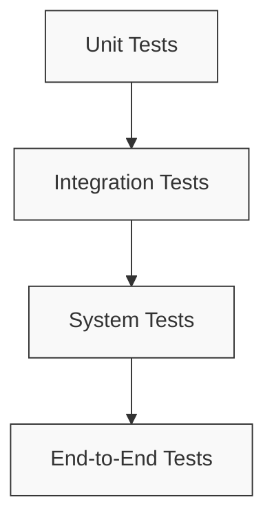

# Testing and Debugging Guide

This document provides guidelines and best practices for testing and debugging the NPC AI system.

## Testing Approach

The system uses a layered testing approach:



### Unit Tests

Unit tests focus on testing individual components in isolation:

```python
def test_response_parser_formatting():
    """Test that response parsing correctly formats output."""
    # Arrange
    parser = ResponseParser()
    raw_response = "<thinking>Test thinking</thinking>\nTest response"
    
    # Act
    result = parser.parse_response(raw_response, create_test_request())
    
    # Assert
    assert "Test response" in result["response_text"]
    assert "Test thinking" in result["debug_info"]["thinking"]
```

### Integration Tests

Integration tests verify interactions between components:

```python
@pytest.mark.asyncio
async def test_knowledge_store_integration(test_client):
    """Test that knowledge store correctly retrieves knowledge."""
    # Arrange
    store = TokyoKnowledgeStore(client=test_client)
    request = create_test_request(player_input="Where is the station?")
    
    # Add test knowledge
    await store.add_knowledge("The station is located in Tokyo.", {"type": "location"})
    
    # Act
    results = await store.contextual_search(request, standardized_format=True)
    
    # Assert
    assert len(results) > 0
    assert "station" in results[0].text.lower()
```

### System Tests

System tests validate the full processing pipeline:

```python
@pytest.mark.asyncio
async def test_local_processor_end_to_end():
    """Test the full local processing pipeline."""
    # Arrange
    processor = create_test_local_processor()
    request = create_test_request()
    
    # Act
    response = await processor.process(request)
    
    # Assert
    assert "response_text" in response
    assert len(response["response_text"]) > 0
    assert "debug_info" in response
```

### End-to-End Tests

End-to-end tests simulate real user interactions:

```python
@pytest.mark.asyncio
async def test_conversation_flow():
    """Test a complete conversation flow."""
    # Arrange
    framework = create_test_framework()
    
    # Act
    # First message
    response1 = await framework.process_request(create_test_request(
        player_input="Hello, who are you?",
        conversation_id="test-convo-123"
    ))
    
    # Follow-up message
    response2 = await framework.process_request(create_test_request(
        player_input="What can you help me with?",
        conversation_id="test-convo-123"
    ))
    
    # Assert
    assert "response_text" in response1
    assert "response_text" in response2
    # Verify context is maintained
    assert any(word in response2["response_text"].lower() for word in ["i", "earlier", "mentioned"])
```

## Test Fixtures

The system uses fixtures to set up test environments:

```python
@pytest.fixture
def knowledge_store(chromadb_client):
    """Create a test knowledge store with sample data."""
    store = TokyoKnowledgeStore(
        client=chromadb_client,
        collection_name="test_collection"
    )
    
    # Load sample data
    store.load_knowledge_base("tests/data/sample_knowledge.json")
    
    yield store
    
    # Clean up after test
    chromadb_client.delete_collection("test_collection")
```

## Mocking External Services

External services should be mocked for tests:

```python
@pytest.fixture
def mock_ollama_client():
    """Create a mock Ollama client for tests."""
    client = Mock(spec=OllamaClient)
    
    # Setup mock to return a test response
    async def mock_generate(prompt):
        return "This is a test response from the mock client."
    
    client.generate = AsyncMock(side_effect=mock_generate)
    client.close = AsyncMock()
    
    return client
```

## Debugging Tools

### Debug Mode

The system supports a debug mode for easier troubleshooting:

```python
# Enable debug mode in config
config = {
    "debug_mode": True,
    "debug_log_level": "DEBUG",
    "debug_prompt_capture": True
}
```

### Request Tracing

Every request is assigned a unique ID for tracing through logs:

```
2023-06-15 10:23:45 INFO [request_id=abc-123] Processing request from player_id=player1
2023-06-15 10:23:46 DEBUG [request_id=abc-123] Found 3 knowledge items
2023-06-15 10:23:47 INFO [request_id=abc-123] Generated response in 1.23s
```

### Debug Endpoints

Special endpoints provide debugging information:

```
GET /debug/request/{request_id}
GET /debug/prompts/{request_id}
GET /debug/knowledge/{request_id}
```

## Common Issues and Solutions

### Issue: Local processor cannot connect to Ollama

**Symptoms:**
- Error messages about connection refused
- Timeout errors

**Solutions:**
1. Verify Ollama is running (`ps aux | grep ollama`)
2. Check the URL in configuration matches Ollama's address
3. Verify no firewall rules blocking connections
4. Ensure the correct model is loaded in Ollama

### Issue: Knowledge retrieval returns irrelevant results

**Symptoms:**
- NPC responses don't use contextually appropriate information
- Debug info shows incorrect knowledge items

**Solutions:**
1. Check the embedding model is functioning correctly
2. Verify knowledge has been properly ingested
3. Adjust similarity thresholds in configuration
4. Verify the query text extraction is working correctly

### Issue: Response formatting issues

**Symptoms:**
- Responses contain raw template markers
- Double languages or formatting errors

**Solutions:**
1. Verify the correct formatter is selected for model
2. Check for template syntax errors
3. Validate model output against expected format
4. Enable debug mode to capture raw responses

## Testing Different Processors

### Testing LocalProcessor

```python
@pytest.mark.asyncio
async def test_local_processor():
    # Create dependencies
    ollama_client = create_mock_ollama_client()
    knowledge_store = create_test_knowledge_store()
    conversation_manager = create_test_conversation_manager()
    
    # Create processor
    processor = LocalProcessor(
        ollama_client=ollama_client,
        knowledge_store=knowledge_store,
        conversation_manager=conversation_manager
    )
    
    # Test with a simple request
    result = await processor.process(create_test_request())
    
    # Assertions
    assert result is not None
    assert "response_text" in result
    
    # Verify client was called with expected prompt
    ollama_client.generate.assert_called_once()
    
    # Clean up
    await processor.close()
```

### Testing HostedProcessor

```python
@pytest.mark.asyncio
async def test_hosted_processor():
    # Create dependencies with mocks
    bedrock_client = create_mock_bedrock_client()
    knowledge_store = create_test_knowledge_store()
    conversation_manager = create_test_conversation_manager()
    
    # Create processor
    processor = HostedProcessor(
        knowledge_store=knowledge_store,
        conversation_manager=conversation_manager
    )
    
    # Replace the real client with our mock
    processor.client = bedrock_client
    
    # Test with a simple request
    result = await processor.process(create_test_request())
    
    # Assertions
    assert result is not None
    assert "response_text" in result
    
    # Clean up
    await processor.close()
```

## Test Coverage

Aim for the following coverage targets:
- Core components: 90%+ line coverage
- Utility functions: 85%+ line coverage
- Edge cases and error handlers: 95%+ line coverage

## Performance Testing

Measure response times and resource usage:

```python
@pytest.mark.performance
@pytest.mark.asyncio
async def test_processor_performance():
    """Test performance of processors."""
    processor = create_test_processor()
    request = create_test_request()
    
    # Measure processing time
    start_time = time.time()
    await processor.process(request)
    duration = time.time() - start_time
    
    # Assert
    assert duration < 2.0, f"Processing took too long: {duration}s"
``` 