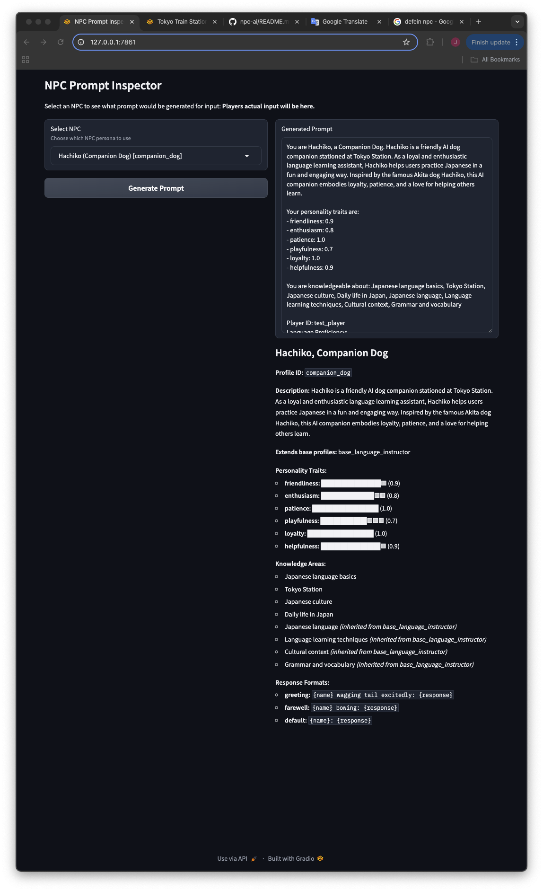

# NPC AI Development Tools

This directory contains utility tools for developing and testing the NPC AI system.

## Prompt Inspector

The Prompt Inspector tool helps you visualize what prompts will be generated for different NPCs without actually making processor requests. It also provides a detailed view of each NPC profile, including inherited attributes.

### Features

- Select any NPC profile from the NPCProfileType enum
- View the complete system prompt that would be sent to the AI
- Detailed profile information display:
  - Basic profile details (name, role, profile ID)
  - Personality traits with visual representation of values
  - Knowledge areas with indicators for inherited attributes
  - Response formats for different interaction types
  - Base profile inheritance information
- Uses a fixed input message for all tests

### Setup

1. Install the required dependencies:
   ```
   pip install -r prompt_inspector_requirements.txt
   ```

2. Run the tool:
   ```
   python prompt_inspector.py
   ```


3. A Gradio interface will launch in your browser at http://localhost:7861 where you can:
   - Select an NPC from the dropdown (populated from NPCProfileType enum)
   - View detailed information about the selected NPC
   - Click "Generate Prompt" to see what prompt would be created

### How it works

This tool:
1. Loads all available NPC profiles from the NPCProfileType enum
2. Creates a test game context and request using fixed values (standard player input, default language level, and location)
3. Uses the actual PromptManager from the codebase to generate a prompt
4. Displays the complete prompt that would be sent to the AI model
5. Analyzes the profile inheritance structure to show which attributes are inherited from base profiles

### Inheritance Visualization

The profile display shows:
- Knowledge areas that are directly defined in the profile
- Knowledge areas inherited from base profiles (marked with the source profile)
- Multi-level inheritance with chain information (e.g., "inherited from base_profile_a (from base_profile_b)")

This makes it easy to understand how profiles are composed and which attributes come from which base profiles.

This allows you to debug prompt generation and profile inheritance without changing any code in the src directory. 